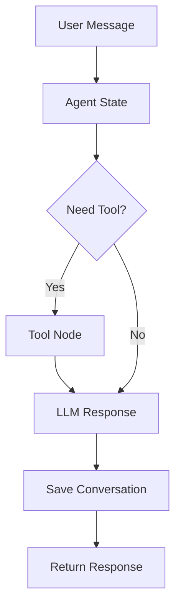
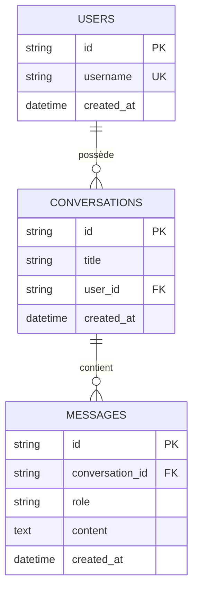
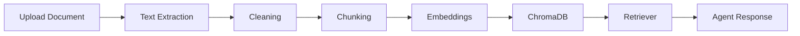
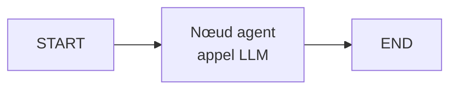
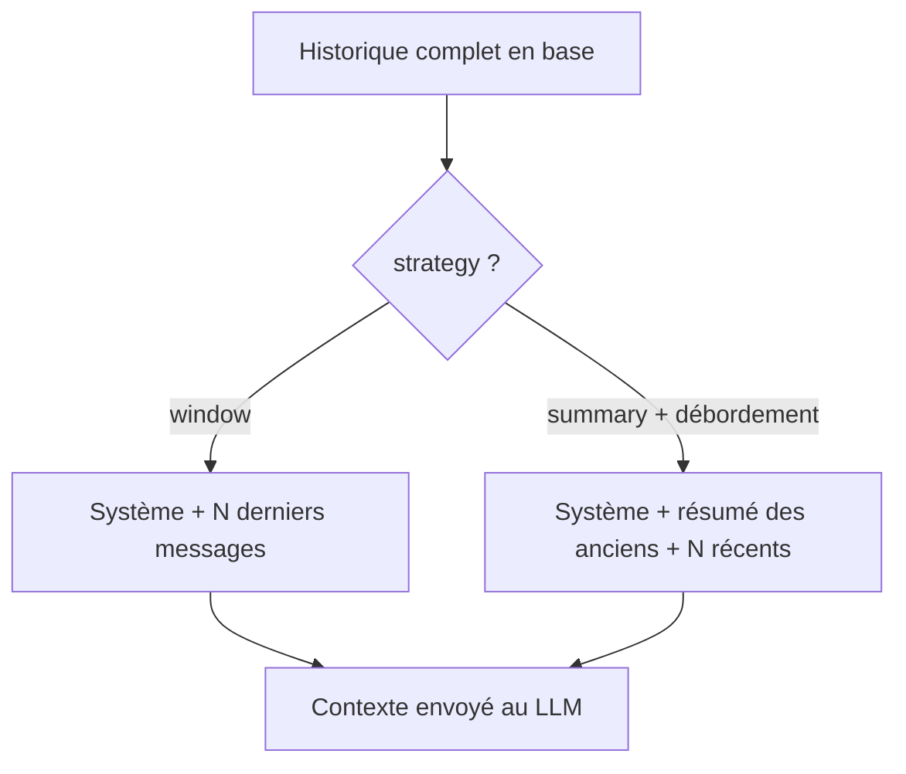

# Full-Stack Agentic AI Chatbot — Production-Ready

> Chatbot IA agentique, modulaire et déployable en production : workflow
> **LangGraph**, **RAG** sur ChromaDB, mémoire conversationnelle SQL, API
> **FastAPI**, frontend **Next.js**, monitoring **LangSmith** et déploiement
> **AWS** (Docker · ECR · EC2 · GitHub Actions).

<p align="left">
  
  
  
  
  
  
</p>

> **Statut : Phase 5 — Pipeline RAG (ChromaDB) en place.** Upload de documents,
> extraction/chunking/embeddings, recherche vectorielle et endpoints
> `/upload` · `/documents`. 23 tests verts (embeddings simulés, sans réseau).
> Prochaine étape : brancher le RAG comme outil de l'agent (Phase 6)
> (voir la [roadmap](#22-améliorations-futures--roadmap)).

---

## Sommaire

1. [Présentation du projet](#1-présentation-du-projet)
2. [Objectifs](#2-objectifs)
3. [Fonctionnalités](#3-fonctionnalités)
4. [Architecture globale](#4-architecture-globale)
5. [Diagramme Mermaid](#5-diagramme-mermaid)
6. [Stack technique](#6-stack-technique)
7. [Structure des dossiers](#7-structure-des-dossiers)
8. [Installation locale](#8-installation-locale)
9. [Configuration `.env`](#9-configuration-env)
10. [Lancement sans Docker](#10-lancement-sans-docker)
11. [Lancement avec Docker](#11-lancement-avec-docker)
12. [Initialisation de la base de données](#12-initialisation-de-la-base-de-données)
13. [Pipeline RAG expliqué](#13-pipeline-rag-expliqué)
14. [Agent LangGraph expliqué](#14-agent-langgraph-expliqué)
15. [API FastAPI documentée](#15-api-fastapi-documentée)
16. [Frontend expliqué](#16-frontend-expliqué)
17. [Tests](#17-tests)
18. [Monitoring LangSmith](#18-monitoring-langsmith)
19. [Déploiement AWS](#19-déploiement-aws)
20. [CI/CD GitHub Actions](#20-cicd-github-actions)
21. [Problèmes fréquents et solutions](#21-problèmes-fréquents-et-solutions)
22. [Améliorations futures / Roadmap](#22-améliorations-futures--roadmap)
23. [Captures d'écran](#23-captures-décran)
24. [Commandes utiles](#24-commandes-utiles)

---

## 1. Présentation du projet

Ce dépôt construit, **étape par étape**, un assistant conversationnel
« agentique » : au lieu d'enchaîner mécaniquement un prompt et une réponse, un
**agent LangGraph** raisonne sur chaque message, décide s'il peut répondre
directement ou s'il doit **appeler un outil** (recherche documentaire, mémoire,
API externe), puis compose une réponse contextuelle. Les conversations sont
persistées en base SQL, les documents sont indexés dans un **vector store**
pour la recherche sémantique (RAG), et l'ensemble est **observable** et
**déployable en production**.

Le projet est pensé comme une **pièce de portfolio** pour un profil Data
Scientist / ML Engineer / AI Engineer / MLOps : architecture claire, code typé
et testé, documentation pédagogique, CI/CD réelle.

## 2. Objectifs

- Comprendre les requêtes et **répondre de manière contextuelle**.
- Orchestrer un **workflow agentique** explicite avec LangGraph.
- **Appeler des outils externes** et interroger des documents via **RAG**.
- Conserver une **mémoire conversationnelle** persistée.
- Exposer une **API FastAPI** propre et documentée (OpenAPI/Swagger).
- Offrir une **interface frontend** moderne (chat, historique, upload).
- Être **monitoré** (LangSmith) et **déployé** sur AWS via Docker + GitHub Actions.
- Rester **multi-fournisseur LLM** (OpenAI · Mistral · Llama) sans secret en dur.

## 3. Fonctionnalités

| Domaine | Fonctionnalité |
|---|---|
| Agent | Routage « répondre vs outil », contexte multi-tours, réponses structurées |
| RAG | Upload, extraction, chunking, embeddings, recherche vectorielle ChromaDB |
| Outils | `rag_search`, mémoire conversationnelle, appel API externe |
| Backend | API REST FastAPI, validation Pydantic, persistance SQL |
| Frontend | Chat, états de chargement, historique, upload, gestion d'erreurs |
| Observabilité | Tracing LangSmith (LLM, étapes, tools, latence, erreurs) |
| Ops | Docker Compose, PostgreSQL, déploiement AWS, CI/CD |

## 4. Architecture globale

L'application sépare nettement les responsabilités : **frontend** (UI) →
**API FastAPI** (validation + délégation) → **agent LangGraph** (orchestration)
→ **tools / RAG / LLM**, avec persistance en **PostgreSQL** (conversations) et
**ChromaDB** (embeddings). Détails et justifications dans
[`docs/architecture.md`](docs/architecture.md).

## 5. Diagramme Mermaid



Vue système complète et diagramme de séquence : [`docs/architecture.md`](docs/architecture.md).

## 6. Stack technique

**IA / orchestration** — LangGraph (agent), LangChain (loaders, retrievers,
tools), LangSmith (tracing).
**Backend** — FastAPI, Pydantic, SQLAlchemy 2.0, Alembic, PostgreSQL
(SQLite en dev rapide).
**RAG** — ChromaDB, document loaders, chunking, embeddings, retriever.
**Frontend** — Next.js (App Router) + TypeScript.
**Déploiement** — Docker, Docker Compose, AWS EC2 + ECR, GitHub Actions.
**LLM** — multi-fournisseur configurable : OpenAI (GPT-4o / 4.1), Mistral,
Llama 3 (API compatible).

## 7. Structure des dossiers

```text
Full-Stack-Agentic-AI-Chatbot/
│
├── backend/
│   ├── app/
│   │   ├── api/v1/       # routeurs FastAPI (chat, conversations, documents, health)
│   │   ├── agents/       # graphe LangGraph (state, nodes, edges)
│   │   ├── core/         # config .env, logging, factory LLM
│   │   ├── db/           # engine + session SQLAlchemy
│   │   ├── models/       # tables ORM
│   │   ├── schemas/      # DTO Pydantic
│   │   ├── services/     # logique métier
│   │   ├── tools/        # outils de l'agent
│   │   ├── rag/          # pipeline RAG (chunk, embed, store, retriever)
│   │   └── main.py       # app FastAPI
│   ├── alembic/          # migrations
│   ├── tests/            # tests pytest
│   ├── Dockerfile
│   └── requirements.txt
│
├── frontend/
│   ├── src/
│   │   ├── app/          # pages Next.js (App Router)
│   │   ├── components/   # composants UI (chat, messages, upload)
│   │   ├── services/     # client API
│   │   └── lib/          # utilitaires
│   └── Dockerfile
│
├── docs/                 # architecture, rag-pipeline, deployment-aws, monitoring
├── scripts/              # scripts de lancement local / prod
├── .github/workflows/    # CI/CD (deploy.yml)
├── docker-compose.yml
├── .env.example
└── README.md
```

## 8. Installation locale

> Implémentation complète en Phase 1+. Procédure cible :

```bash
git clone <repo-url>
cd Full-Stack-Agentic-AI-Chatbot
cp .env.example .env   # puis renseigner les clés
```

Prérequis : Python 3.11+, Node 20+, Docker (optionnel mais recommandé).

## 9. Configuration `.env`

Toute la configuration passe par variables d'environnement — **aucun secret
dans le code**. Copier `.env.example` en `.env` et renseigner au minimum la clé
du fournisseur LLM choisi (`LLM_PROVIDER`). Variables clés :

```env
LLM_PROVIDER=openai
LLM_MODEL=gpt-4o-mini
OPENAI_API_KEY=
MISTRAL_API_KEY=
LANGCHAIN_API_KEY=
DATABASE_URL=postgresql+psycopg://chatbot:chatbot@db:5432/chatbot
CHROMA_PATH=./data/chroma
```

Liste exhaustive et commentée : [`.env.example`](.env.example).

## 10. Lancement sans Docker

**Backend (Phase 1 — disponible).**

```bash
cd backend
python3 -m venv .venv && source .venv/bin/activate   # Windows: .venv\Scripts\activate
pip install -r requirements.txt
uvicorn app.main:app --reload --port 8000
```

Vérifier ensuite :

```bash
curl http://localhost:8000/health
# {"status":"ok","app":"agentic-chatbot","version":"0.1.0","environment":"development"}
```

- API : http://localhost:8000 · Swagger : http://localhost:8000/docs

Raccourci : `./scripts/run_backend_local.sh` (crée le venv, installe, lance).

**Frontend** — _à compléter en Phase 7._

## 11. Lancement avec Docker

> _À compléter en Phase 8._ Procédure cible :

```bash
cp .env.example .env
docker compose up --build
```

Accès attendu :

```text
Backend API : http://localhost:8000
Swagger UI  : http://localhost:8000/docs
Frontend    : http://localhost:3000
```

## 12. Initialisation de la base de données

**Modèle de données (Phase 2).** Trois tables liées par clés étrangères
(`ON DELETE CASCADE`) :



Choix : identifiants **UUID** (str, portables SQLite/Postgres), `role` stocké en
chaîne (validée par l'enum `MessageRole` côté application), timestamps gérés par
la base via un mixin.

**Migrations Alembic.** Le moteur applicatif est asynchrone ; Alembic tourne en
mode synchrone et dérive l'URL depuis `DATABASE_URL` (cf. `alembic/env.py`).

```bash
cd backend

# Créer / mettre à jour le schéma jusqu'à la dernière version
alembic upgrade head

# Après modification des modèles : générer une nouvelle migration
alembic revision --autogenerate -m "description du changement"

# Revenir une migration en arrière
alembic downgrade -1

# Vérifier l'état courant
alembic current
```

**Vérifier les tables** (exemple SQLite dev) :

```bash
sqlite3 app.db ".tables"     # users  conversations  messages  alembic_version
```

**Réinitialiser la base en développement** (SQLite) : supprimer le fichier puis
réappliquer les migrations.

```bash
rm -f app.db && alembic upgrade head
```

> Astuce : sur un disque réseau/monté, SQLite peut renvoyer « disk I/O error ».
> Utiliser un chemin local (`DATABASE_URL=sqlite+aiosqlite:////tmp/app.db`) ou
> PostgreSQL.

## 13. Pipeline RAG expliqué

Le **RAG** permet à l'agent de répondre à partir de **tes documents**. Deux
temps : l'**ingestion** (upload → extraction → nettoyage → chunking → embeddings
→ ChromaDB) et la **recherche** (question → chunks les plus proches → contexte).



Chaque chunk porte `document_id` + `chunk_index` et un id vectoriel déterministe
(`<document_id>:<index>`), ce qui permet de supprimer proprement tous les
vecteurs d'un document. Les métadonnées (nom, taille, statut, nombre de chunks)
sont en SQL (`documents`) ; le texte des chunks et leurs embeddings dans Chroma.

Détails, choix et configuration : [`docs/rag-pipeline.md`](docs/rag-pipeline.md).

## 14. Agent LangGraph expliqué

Concept : un **graphe d'états** où chaque nœud est une étape et où les arêtes
(parfois conditionnelles) décident du chemin selon le besoin.

**Version Phase 3 (minimale)** — un seul nœud `agent` qui appelle le LLM :



Le pipeline d'un tour de conversation (service `ChatService`) :

1. retrouver ou créer la conversation ;
2. enregistrer le message utilisateur ;
3. construire le contexte via le **`MemoryManager`** (Phase 4) ;
4. exécuter le graphe (`graph.ainvoke`) ;
5. enregistrer puis renvoyer la réponse de l'assistant.

### Mémoire conversationnelle (Phase 4)

Envoyer tout l'historique à chaque tour coûte cher et finit par dépasser la
fenêtre de contexte du modèle. Le `MemoryManager` construit le contexte selon
une stratégie configurable (`MEMORY_STRATEGY`) :

- **`window`** (défaut) — ne garde que les `MEMORY_WINDOW_SIZE` derniers
  messages. Rapide, sans coût LLM.
- **`summary`** — au-delà de la fenêtre, **résume** les messages les plus
  anciens (via le LLM) et conserve les récents tels quels.

Un prompt système ouvre toujours le contexte. La **session** est la conversation
elle-même : son `conversation_id` regroupe et isole l'historique. Le tri des
messages est déterministe (timestamps en résolution microseconde).



Le **modèle est injecté** (dépendance `get_chat_model`) : en production c'est le
provider configuré, en test un `FakeListChatModel` déterministe — d'où des tests
sans clé API ni réseau. Le routage conditionnel et les nœuds d'outils arrivent en
Phase 6, sans refonte (la structure en graphe est déjà là).

## 15. API FastAPI documentée

Routes cibles du projet :

```text
POST   /api/v1/chat
GET    /api/v1/conversations
GET    /api/v1/conversations/{conversation_id}
POST   /api/v1/upload
GET    /api/v1/documents
DELETE /api/v1/documents/{document_id}
GET    /health
```

**`GET /health`** (Phase 1) : liveness probe sans dépendance externe, exposée à
la racine (`/health`) et sous l'API (`/api/v1/health`). Sortie :
`{ status, app, version, environment }`.

**`POST /api/v1/chat`** (Phase 3) : envoie un message à l'agent.

| | |
|---|---|
| Entrée | `{ "message": str, "conversation_id"?: str }` |
| Sortie | `{ "conversation_id": str, "message_id": str, "response": str }` |
| Erreurs | `404` si `conversation_id` inconnu, `422` si message vide |

```bash
# Nouveau fil de conversation
curl -s -X POST http://localhost:8000/api/v1/chat \
  -H "Content-Type: application/json" \
  -d '{"message":"Bonjour, que peux-tu faire ?"}'
# {"conversation_id":"<uuid>","message_id":"<uuid>","response":"..."}

# Poursuivre le même fil
curl -s -X POST http://localhost:8000/api/v1/chat \
  -H "Content-Type: application/json" \
  -d '{"message":"Et en résumé ?","conversation_id":"<uuid>"}'
```

**`GET /api/v1/conversations`** (Phase 3) : liste les conversations
(`[{ id, title, created_at }]`).

**`GET /api/v1/conversations/{id}`** (Phase 3) : détail avec messages
(`{ id, title, created_at, messages: [{ id, role, content, created_at }] }`),
`404` si introuvable.

**`POST /api/v1/upload`** (Phase 5) : `multipart/form-data` avec un champ `file`.
Déclenche l'ingestion RAG et renvoie le document (`201`), `400` si fichier vide.

```bash
curl -s -X POST http://localhost:8000/api/v1/upload \
  -F "file=@mon_document.pdf"
# {"id":"<uuid>","filename":"mon_document.pdf","num_chunks":12,"status":"ready",...}
```

**`GET /api/v1/documents`** (Phase 5) : liste les documents indexés.

**`DELETE /api/v1/documents/{id}`** (Phase 5) : supprime le document et ses
vecteurs (`204`), `404` si introuvable.

## 16. Frontend expliqué

> _À compléter en Phase 7._ Interface Next.js : zone de chat, messages
> user/assistant, état de chargement, historique, upload de documents, gestion
> d'erreurs, design responsive. Communication avec FastAPI via un service API isolé.

## 17. Tests

Backend (Phases 1–5 — `/health`, OpenAPI, modèles, agent `/chat`, mémoire, RAG) :

```bash
cd backend
pytest -q
# 23 passed
```

Les tests de l'agent utilisent un faux modèle (`FakeListChatModel`) : aucune clé
API ni appel réseau requis.

La couverture s'étend à chaque phase (services, RAG, tools, agent).

## 18. Monitoring LangSmith

> _À compléter en Phase 10._ Aperçu : [`docs/monitoring.md`](docs/monitoring.md).

## 19. Déploiement AWS

> _À compléter en Phase 11._ Aperçu : [`docs/deployment-aws.md`](docs/deployment-aws.md).

## 20. CI/CD GitHub Actions

> _À compléter en Phase 11._ Pipeline : build Docker → push ECR → pull EC2 →
> restart container → healthcheck. Fichier cible : `.github/workflows/deploy.yml`.

## 21. Problèmes fréquents et solutions

> _Enrichi au fil des phases._ Exemples anticipés : clé LLM manquante, URL de
> base de données invalide, volume Chroma non persistant, CORS frontend↔backend.

## 22. Améliorations futures / Roadmap

| Phase | Contenu |
|---|---|
| **0 ✅** | Cadrage, architecture, scaffolding, README |
| **1 ✅** | Backend FastAPI minimal + `/health` + config |
| **2 ✅** | DB SQLAlchemy + modèles + Alembic |
| **3 ✅** | Agent LangGraph minimal + `/chat` |
| **4 ✅** | Mémoire conversationnelle |
| **5 ✅** | RAG ChromaDB |
| 6 | Tools agentiques + tool calling |
| 7 | Frontend Next.js |
| 8 | Dockerisation |
| 9 | Tests & qualité |
| 10 | Monitoring LangSmith |
| 11 | Déploiement AWS + CI/CD |
| 12 | Finalisation portfolio |

Pistes au-delà de la v1 : streaming des réponses, authentification
multi-utilisateur, RAG multi-collections, évaluation automatique (LangSmith
datasets), support multimodal.

## 23. Captures d'écran

> _À ajouter au fil des phases (UI de chat, Swagger, traces LangSmith, console AWS)._

## 24. Commandes utiles

```bash
# Cloner et configurer
git clone <repo-url> && cd Full-Stack-Agentic-AI-Chatbot
cp .env.example .env

# (Phase 8+) Tout lancer
docker compose up --build

# (Phase 9+) Tests
pytest -q
```

---

*Projet développé par phases. Voir [`docs/architecture.md`](docs/architecture.md)
pour les décisions techniques détaillées.*
