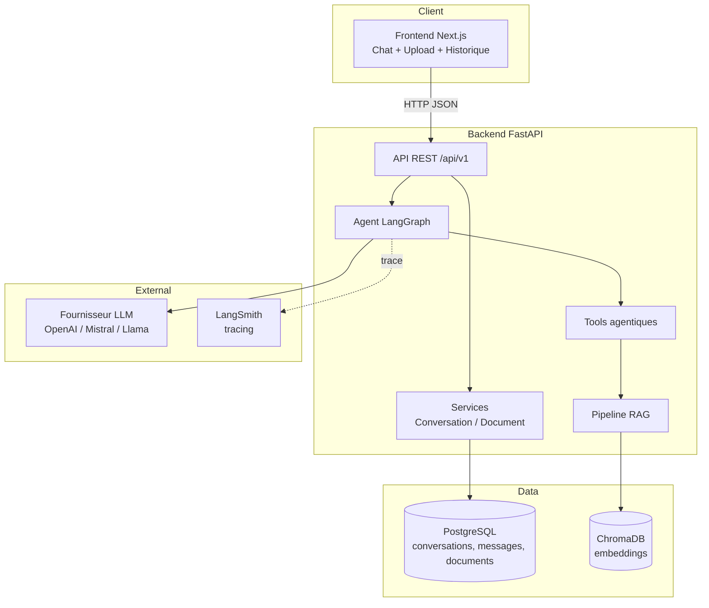
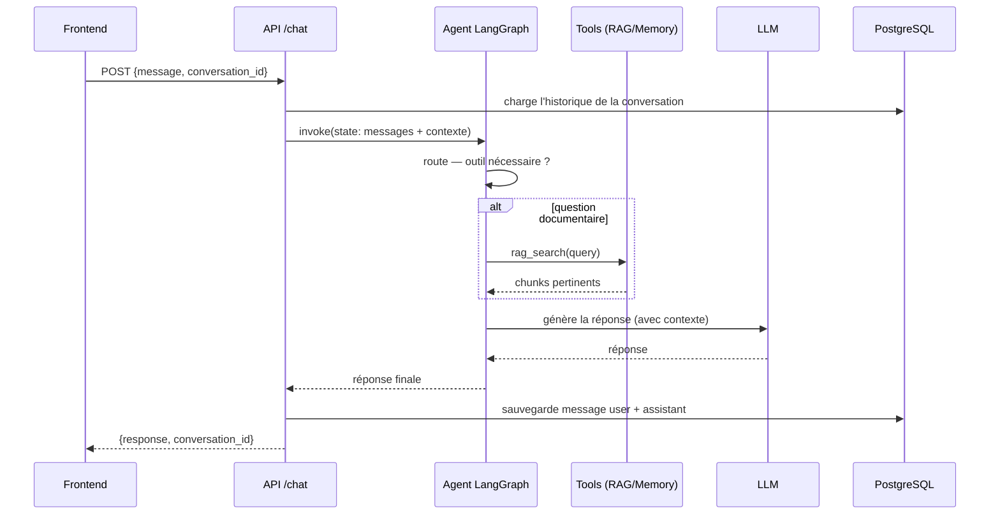

# Architecture & décisions techniques

> Document de cadrage (Phase 0). Il fige le périmètre, l'architecture cible et
> les choix techniques **avant** d'écrire du code. Chaque phase ultérieure
> viendra le compléter.

## 1. Périmètre fonctionnel

L'application est un **chatbot agentique** capable de :

1. recevoir une question utilisateur via une API REST ;
2. analyser l'intention et **décider** s'il répond directement ou via un outil ;
3. interroger des documents via un pipeline **RAG** (ChromaDB) ;
4. conserver une **mémoire conversationnelle** persistée en base SQL ;
5. appeler des **outils externes** (RAG search, mémoire, API publique) ;
6. exposer une interface **frontend** de chat avec upload de documents ;
7. être **observable** (LangSmith) et **déployable** (Docker → AWS).

Hors périmètre v1 : authentification multi-tenant complète, streaming token par
token, fine-tuning de modèle, multi-modalité (image/audio). Ces points figurent
dans la roadmap « améliorations futures ».

## 2. Vue d'ensemble



## 3. Choix techniques justifiés

| Domaine | Choix | Pourquoi |
|---|---|---|
| Orchestration agent | **LangGraph** | Graphe d'états explicite (nœuds/arêtes conditionnelles) : on visualise et on teste le routage « répondre vs appeler un outil », contrairement à une chaîne linéaire. |
| Framework LLM | **LangChain** (loaders, retrievers, tools) | Écosystème mûr réutilisé par LangGraph ; évite de réécrire chunking/retriever à la main. |
| Abstraction LLM | **Provider configurable** (`LLM_PROVIDER`) | Découple le code du fournisseur : on bascule OpenAI ↔ Mistral ↔ Llama via `.env`, sans toucher à la logique métier. Clés **jamais** en dur. |
| Backend | **FastAPI + Pydantic** | Async natif, validation/serialisation typée, OpenAPI/Swagger auto. |
| ORM / migrations | **SQLAlchemy 2.0 + Alembic** | Modèles typés, migrations versionnées reproductibles en prod. |
| Base SQL | **PostgreSQL** (prod) / SQLite (dev rapide) | Postgres robuste et concurrent ; SQLite zéro-config pour démarrer. URL pilotée par `DATABASE_URL`. |
| Vector store | **ChromaDB** | Léger, embarquable (persistance disque via volume), suffisant pour un RAG mono-nœud. |
| Frontend | **Next.js (App Router) + TypeScript** | SSR/routing/build prod intégrés, déploiement Docker simple, meilleur pour un rendu portfolio qu'un CRA brut. Service API isolé pour découpler l'UI du backend. |
| Monitoring | **LangSmith** | Tracing natif LangGraph/LangChain : latence, étapes, tool calls, erreurs. |
| Conteneurisation | **Docker + Docker Compose** | Environnement reproductible : backend, frontend, Postgres, volume Chroma. |
| CI/CD | **GitHub Actions → ECR → EC2** | Build image, push registre, déploiement et healthcheck automatisés. |

### Pourquoi Next.js plutôt que React (CRA/Vite) ?

Next.js apporte le routing, le build de production optimisé et un modèle de
déploiement Docker standard sans configuration supplémentaire — utile pour un
projet « production-ready ». Si vous préférez un SPA Vite + React pur, l'archi
reste valable : seul le dossier `frontend/` change. *(modifiable, voir README.)*

## 4. Modules backend (responsabilités)

```
backend/app/
├── api/v1/        # routeurs FastAPI (chat, conversations, documents, health)
├── agents/        # graphe LangGraph : state, nodes, edges conditionnelles
├── core/          # config (.env → Settings Pydantic), logging, LLM factory
├── db/            # session/engine SQLAlchemy, base declarative
├── models/        # tables ORM (User, Conversation, Message, Document, Chunk)
├── schemas/       # DTO Pydantic (entrées/sorties API)
├── services/      # logique métier (conversation, document, ingestion)
├── tools/         # outils de l'agent (rag_search, memory, external_api)
├── rag/           # loaders, chunking, embeddings, retriever, store Chroma
└── main.py        # création de l'app FastAPI + montage des routeurs
```

Principe : l'**API** ne contient pas de logique métier (elle valide et délègue
aux **services**) ; l'**agent** orchestre **tools** et **LLM** ; le **RAG** est
isolé pour être testable indépendamment.

## 5. Flux d'une requête `/chat`



## 6. Roadmap de développement (phases)

| Phase | Contenu | Livrable clé |
|---|---|---|
| **0** | Cadrage, archi, scaffolding, README | *(ce document)* |
| 1 | Backend FastAPI minimal + `/health` + config `.env` | app qui démarre |
| 2 | DB SQLAlchemy + modèles + Alembic | migrations OK |
| 3 | Agent LangGraph minimal + `/chat` | réponse LLM persistée |
| 4 | Mémoire conversationnelle | contexte multi-tours |
| 5 | RAG ChromaDB (upload→chunk→embed→search) | réponses augmentées |
| 6 | Tools agentiques + tool calling | routage outils |
| 7 | Frontend Next.js (chat, historique, upload) | UI fonctionnelle |
| 8 | Dockerisation + docker-compose | `docker compose up` |
| 9 | Tests + lint + qualité | `pytest` vert |
| 10 | Monitoring LangSmith | traces lisibles |
| 11 | Déploiement AWS (ECR/EC2/Actions) | déploiement auto |
| 12 | Finalisation portfolio | README final + démo |

## 7. Principes de qualité

- Code **typé** (Pydantic, SQLAlchemy 2.0 typed, TypeScript) et modulaire.
- **Aucun secret** dans le code : tout passe par `.env` / GitHub Secrets.
- Chaque couche **testable** isolément (services, RAG, tools, agent, routes).
- Migrations **versionnées**, environnements **reproductibles** via Docker.
