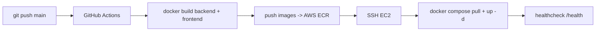

# Déploiement AWS + CI/CD

Déploiement continu : un push sur `main` déclenche GitHub Actions qui **build**
les images Docker, les **pousse sur ECR**, puis se connecte en **SSH à EC2**
pour tirer les nouvelles images et redémarrer les conteneurs, avec
**healthcheck**.



## 1. Pré-requis AWS

### 1.1 Créer les dépôts ECR

```bash
aws ecr create-repository --repository-name agentic-chatbot-backend
aws ecr create-repository --repository-name agentic-chatbot-frontend
```

### 1.2 Utilisateur IAM pour le CI

Créer un utilisateur IAM (accès programmatique) avec au minimum la policy
`AmazonEC2ContainerRegistryPowerUser` (push/pull ECR). Récupérer
`AWS_ACCESS_KEY_ID` et `AWS_SECRET_ACCESS_KEY`.

### 1.3 Instance EC2

- Lancer une instance (Ubuntu 22.04, t3.small minimum — chromadb + Postgres).
- Groupe de sécurité : ouvrir 22 (SSH, restreint à ton IP), 3000 (frontend),
  8000 (API). En production réelle, préférer un reverse proxy (Nginx/Caddy) +
  HTTPS devant, et ne pas exposer 8000 directement.
- Installer Docker + le plugin compose, et l'AWS CLI :

```bash
sudo apt-get update && sudo apt-get install -y docker.io docker-compose-plugin awscli
sudo usermod -aG docker $USER   # puis se reconnecter
```

- Préparer le dossier de déploiement :

```bash
sudo mkdir -p /opt/agentic-chatbot && sudo chown $USER /opt/agentic-chatbot
cd /opt/agentic-chatbot
# Copier docker-compose.prod.yml (depuis le repo) et créer .env (secrets prod)
```

Le `.env` sur l'EC2 contient les secrets de production (clé LLM, mot de passe
Postgres, LangSmith…). Il n'est **jamais** committé.

## 2. Secrets GitHub

Repository → Settings → Secrets and variables → Actions :

| Secret | Description |
|---|---|
| `AWS_ACCESS_KEY_ID` | clé de l'utilisateur IAM CI |
| `AWS_SECRET_ACCESS_KEY` | secret associé |
| `AWS_REGION` | ex. `eu-west-3` |
| `PUBLIC_API_BASE_URL` | URL publique de l'API vue du navigateur, ex. `http://<EC2_IP>:8000/api/v1` |
| `EC2_HOST` | IP/DNS public de l'instance |
| `EC2_USER` | ex. `ubuntu` |
| `EC2_SSH_KEY` | clé privée SSH (contenu du .pem) |

`PUBLIC_API_BASE_URL` est injectée au **build** du frontend (variable
`NEXT_PUBLIC_*` inlinée côté navigateur) : elle doit pointer vers l'API telle
qu'un navigateur y accède, pas vers le réseau interne Docker.

## 3. Workflows

- **`.github/workflows/ci.yml`** — sur chaque push/PR : `ruff check` + `pytest`
  (backend) et `npm run build` (frontend). C'est le garde-fou qualité.
- **`.github/workflows/deploy.yml`** — sur push `main` (ou manuel) : build +
  push ECR (tags `:latest` et `:<sha>`), puis déploiement SSH sur EC2.

## 4. Déploiement sur EC2 (ce que fait le workflow)

```bash
aws ecr get-login-password --region <region> | docker login --username AWS --password-stdin <registry>
cd /opt/agentic-chatbot
export REGISTRY=<registry>
docker compose -f docker-compose.prod.yml pull
docker compose -f docker-compose.prod.yml up -d
# healthcheck : boucle sur http://localhost:8000/health
```

`docker-compose.prod.yml` référence les images ECR
(`${REGISTRY}/agentic-chatbot-backend:latest` et `…-frontend:latest`), lance
Postgres avec un volume persistant, et applique les migrations au démarrage du
conteneur backend (comme en local).

## 5. Stratégie de mise à jour

- Images taguées par **SHA de commit** (traçabilité) + `latest` (déployé).
- `docker compose pull` puis `up -d` : recrée seulement les conteneurs dont
  l'image a changé. Les volumes (`pgdata`, `chroma`) survivent aux
  redéploiements.
- **Rollback** : re-tag une image `:<sha>` connue en `:latest` (ou pin l'image
  dans le compose) puis `pull` + `up -d`.
- **Healthcheck** : le workflow échoue si `/health` ne répond pas — on voit
  l'échec directement dans Actions.

## 6. Pistes production (au-delà de la v1)

- Reverse proxy Nginx/Caddy + HTTPS (Let's Encrypt), ne pas exposer 8000.
- RDS managé au lieu de Postgres en conteneur.
- Secrets via AWS Secrets Manager plutôt qu'un `.env` sur l'instance.
- Rôle IAM sur l'instance (au lieu de `aws ecr get-login-password` avec clés).
