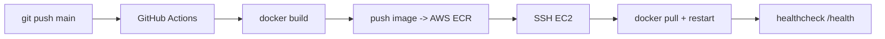

# Déploiement AWS (à détailler en Phase 11)

Stub de documentation. Couvrira : création du repository **ECR**, configuration
de l'instance **EC2**, secrets GitHub, workflow **GitHub Actions**
(build → push ECR → pull EC2 → restart container → healthcheck).

