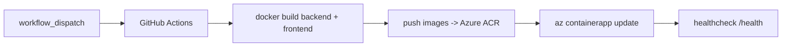

# Déploiement Azure + CI/CD (Container Apps)

Alternative à [AWS](deployment-aws.md). Le **code applicatif est identique** :
seule la couche déploiement change. On utilise **Azure Container Apps** (ACA),
l'option la plus adaptée aux conteneurs applicatifs (serverless, montée en charge
automatique, scale-to-zero).



## Correspondance AWS -> Azure

| Rôle | AWS | Azure |
|---|---|---|
| Registre d'images | ECR | **ACR** (Azure Container Registry) |
| Exécution conteneurs | EC2 + compose | **Azure Container Apps** |
| Base de données | RDS | **Azure Database for PostgreSQL Flexible Server** |
| Secrets | GitHub / Secrets Manager | GitHub / **Azure Key Vault** |
| Auth CI | clés IAM | **OIDC** (`azure/login`, sans mot de passe) |

## 1. Pré-requis Azure (CLI)

```bash
az login
RG=agentic-chatbot-rg
LOC=francecentral
az group create -n $RG -l $LOC

# Registre de conteneurs (ACR)
az acr create -n <acrName> -g $RG --sku Basic

# Base PostgreSQL managée
az postgres flexible-server create \
  -g $RG -n agentic-chatbot-db \
  --admin-user chatbot --admin-password '<motdepasse>' \
  --database-name chatbot --public-access 0.0.0.0

# Environnement Container Apps
az extension add --name containerapp --upgrade
az containerapp env create -n agentic-chatbot-env -g $RG -l $LOC
```

### Créer les deux Container Apps

```bash
ACR=<acrName>.azurecr.io

# Backend (port 8000), variables d'environnement de prod
az containerapp create \
  -n agentic-chatbot-backend -g $RG --environment agentic-chatbot-env \
  --image $ACR/agentic-chatbot-backend:latest \
  --target-port 8000 --ingress external \
  --registry-server $ACR \
  --env-vars \
    DATABASE_URL="postgresql+psycopg://chatbot:<pwd>@agentic-chatbot-db.postgres.database.azure.com:5432/chatbot" \
    OPENAI_API_KEY=secretref:openai-key \
    CHROMA_PATH=/data/chroma

# Frontend (port 3000)
az containerapp create \
  -n agentic-chatbot-frontend -g $RG --environment agentic-chatbot-env \
  --image $ACR/agentic-chatbot-frontend:latest \
  --target-port 3000 --ingress external \
  --registry-server $ACR
```

> Les vrais secrets (clé LLM, mot de passe DB) se déclarent via
> `az containerapp secret set` puis se référencent avec `secretref:` — jamais en
> clair.

## 2. Authentification OIDC (recommandée)

Créer une identité (App Registration) avec un *federated credential* sur le
dépôt GitHub, et lui donner les rôles `AcrPush` (sur l'ACR) et `Contributor`
(sur le resource group). On évite ainsi tout mot de passe dans GitHub.

## 3. Secrets GitHub

| Secret | Description |
|---|---|
| `AZURE_CLIENT_ID` | ID de l'App Registration (OIDC) |
| `AZURE_TENANT_ID` | ID du tenant Azure AD |
| `AZURE_SUBSCRIPTION_ID` | ID de l'abonnement |
| `AZURE_RESOURCE_GROUP` | ex. `agentic-chatbot-rg` |
| `ACR_NAME` | nom court de l'ACR (sans `.azurecr.io`) |
| `PUBLIC_API_BASE_URL` | URL publique de l'API vue du navigateur (ingress backend + `/api/v1`) |
| `BACKEND_URL` | URL publique de l'API pour le healthcheck |

## 4. Le workflow

`.github/workflows/deploy-azure.yml` (déclenchement **manuel**,
`workflow_dispatch`, pour ne pas entrer en conflit avec le déploiement AWS sur
`main`) : login OIDC -> push ACR -> `az containerapp update` (backend +
frontend) -> healthcheck.

Comme sur AWS, les migrations s'appliquent au **démarrage du conteneur backend**
(`alembic upgrade head` dans le `CMD`), donc rien de spécifique à Azure ici.

## 5. Persistance de ChromaDB (point important)

Container Apps est **stateless** : un volume local (`CHROMA_PATH=/data/chroma`)
ne survit pas à un redémarrage. Deux options en production :

1. **Monter un partage Azure Files** sur le conteneur backend (stockage
   persistant pour `/data/chroma`) :
   ```bash
   az containerapp env storage set -g $RG -n agentic-chatbot-env \
     --storage-name chroma --azure-file-account-name <compte> \
     --azure-file-account-key <clé> --azure-file-share-name chroma \
     --access-mode ReadWrite
   # puis référencer ce volume dans la définition du container app
   ```
2. Passer à un **vector store managé** (ex. Azure AI Search) — c'est une piste
   d'évolution, l'abstraction `VectorStore` du projet le permet sans toucher à la
   logique métier.

## 6. Stratégie de mise à jour / rollback

- Images taguées par **SHA** + `latest`. `az containerapp update` crée une
  nouvelle **révision** ; ACA permet le trafic pondéré entre révisions
  (déploiement bleu-vert / canari).
- **Rollback** : réactiver une révision précédente
  (`az containerapp revision activate`) ou redéployer un SHA connu.

## 7. AWS ou Azure : comment choisir

Les deux workflows coexistent. Utiliser `deploy.yml` (AWS, sur push `main`) **ou**
déclencher manuellement `deploy-azure.yml` (Azure). Ne pas activer les deux sur le
même déclencheur pour éviter un double déploiement.
